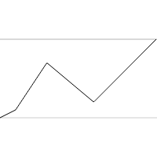
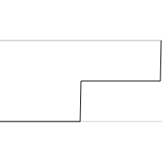
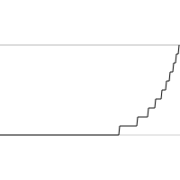

# fancy-eases

[](http://github.com/badges/stability-badges)

This is a set of easing equations which are outside of standard Penner easing equations.

## Usage

### `var bezier = require('fancy-eases/bezier')([opts])`


*`Will render eases based on cubic bezier curves`*

This function will return an ease equation based on a cubic bezier curve.

It should be noted this simply wraps the [`cubic-bezier`](http://www.npmjs.com/cubic-bezier) module to have a consistent api with the rest of the fancy eases.

Optionally you can pass in the following options:
- `points` an array of four numbers which represent a cubic bezier curve default `[0.21,1.08,1,-0.96]`
- `precision` the higher the value the more precise the curve will be default value `1000`


### `var points = require('fancy-eases/points')([opts])`


*`Will render a series points which define an easing equation`*

Returns a function that will perform eases based on custom points you've passed in.

Options:
- `points` a two dimensional array that is formatted in the following way:
```javascript
[
    [ value, time ],
    [ value, time ],
    [ value, time ]
]
```
Where `value` is a value the interpolation amount at the time defined by `time`.

### `var stepped = require('fancy-eases/stepped')([opts])`


*`Rendering with two steps`*


*`Rendering with two steps and ease expo`*

Returns an easing function for stepped eases with the following optional options:
- `steps` the number of steps you'd like to have. The above is with two steps. Default value `1`
- `ease` an ease equation which will modify the original steps.

[](https://www.npmjs.com/package/fancy-eases)

## License

MIT, see [LICENSE.md](http://github.com/Jam3/fancy-eases/blob/master/LICENSE.md) for details.
